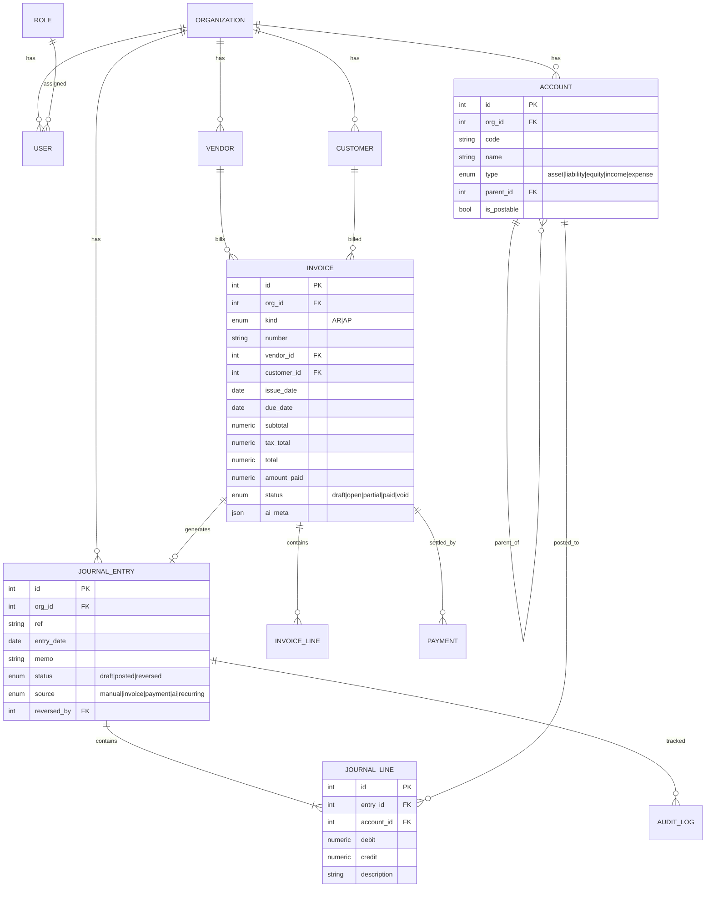

# Database Design

PostgreSQL in production, SQLite for zero-config dev. Schema is defined in
`backend/app/models/` (SQLAlchemy 2.0 typed models). Every domain table carries
`org_id` for multi-tenancy and `created_at`/`updated_at`.

## ER diagram (core / Phase 1)

## Chart of Accounts (seeded)

A standard India/GAAP-friendly COA is seeded. Types drive the normal balance and
statement placement:

| Type | Normal balance | Statement |
|---|---|---|
| Asset | Debit | Balance Sheet |
| Liability | Credit | Balance Sheet |
| Equity | Credit | Balance Sheet |
| Income | Credit | P&L |
| Expense | Debit | P&L |

Example seeded accounts: `1000 Cash`, `1010 Bank`, `1100 Accounts Receivable`,
`1200 Inventory`, `1500 Fixed Assets`, `2000 Accounts Payable`,
`2100 GST Payable`, `2110 TDS Payable`, `3000 Share Capital`,
`4000 Sales Revenue`, `5000 COGS`, `6000 Operating Expenses`,
`6100 Rent`, `6200 Salaries`.

## Posting rules (double-entry engine)

The engine (`services/ledger.py`) guarantees:

1. **Balanced:** Σ debit == Σ credit for every entry, else rejected.
2. **Postable accounts only:** lines may only hit leaf/`is_postable` accounts.
3. **Immutability:** a `posted` entry is never edited. Corrections create a
   linked reversing entry (`reversed_by`).
4. **Period safety:** entries in a locked fiscal period are rejected.

### Auto-generated entries

| Business event | Debit | Credit |
|---|---|---|
| AR invoice posted | Accounts Receivable | Sales Revenue + GST Payable |
| AR payment received | Bank | Accounts Receivable |
| AP bill posted | Expense/Asset + GST Input | Accounts Payable |
| AP payment made | Accounts Payable | Bank |

## Indexes (Phase 1)

`account(org_id, code)`, `journal_entry(org_id, entry_date, status)`,
`journal_line(entry_id)`, `journal_line(account_id)`,
`invoice(org_id, kind, status, due_date)`, `payment(invoice_id)`.

## Migrations

Alembic is wired for Postgres (`alembic/`). For the SQLite dev default,
`scripts/seed.py` uses `create_all` for a friction-free first run.
